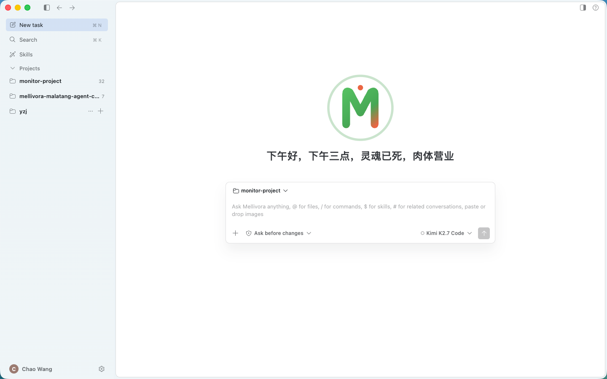
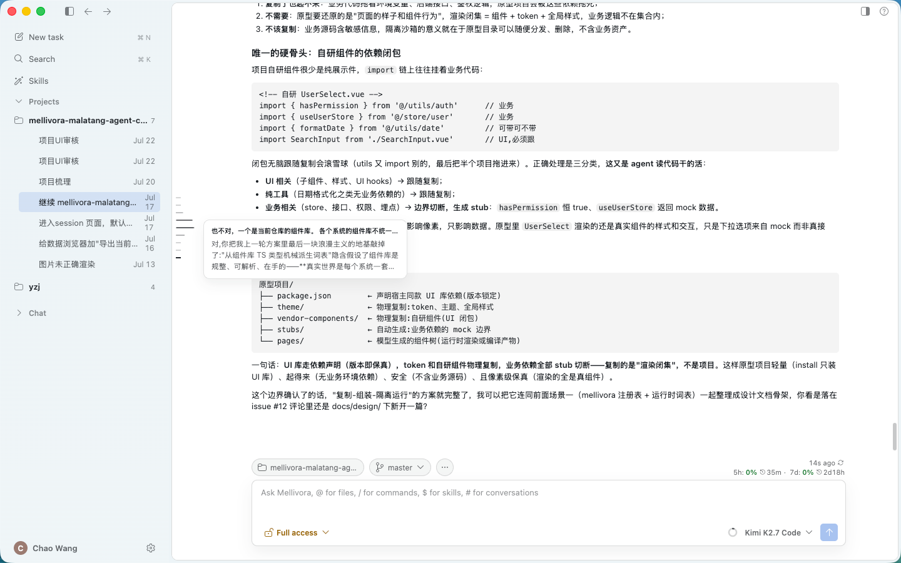

# Mellivora Malatang

**中文** · [English](README.en.md)

一个跑在自己电脑上的桌面版 Agent 对话客户端。

它面向的场景不是"和模型聊天"，而是**让 Agent 真正参与到一个项目的日常工作里**：读代码、查数据库、登服务器、出方案、给结论。你把一个项目连同它的代码、数据库、服务器、知识库一起交给它，然后用对话的方式把活派出去。



左边按项目组织会话，中间开始一次新任务：选好项目、挑一个模型、定好这次给 Agent 多大权限，然后把活说出来。



进到会话里，Agent 的分析、代码、方案连续呈现；底部随时能看到当前项目、所在分支和用量。

## 它解决什么问题

排查一个线上问题、做一次数据核对、理解一段没人讲得清的老逻辑，通常要在 IDE、数据库客户端、终端、文档站之间来回切。真正花时间的不是某一步，而是在这些工具之间搬运上下文。

Mellivora 把这些东西收拢到一个会话里。Agent 手上同时握着这个项目的代码和运行环境，所以它可以自己走完"看代码 → 查数据 → 上机器确认 → 给出结论"这一整条链路，而不是每一步都要你手动喂给它。

## 主要能力

**以项目组织工作**
一个项目就是一套完整的工作环境：代码来源（本地目录或远程仓库）、各环境的数据库 / Redis / 消息队列 / 配置中心 / Elasticsearch 连接、可登录的服务器、以及接入的知识库。同一个项目下可以并行开很多个会话，各自独立。

**区分环境**
连接是按 dev / test / prod 分别配置的。Agent 知道自己现在在哪个环境上操作，生产环境默认只读。

**能动手，但每一步你说了算**
Agent 可以读写文件、执行命令、查询数据库、登录服务器。涉及真实影响的操作会停下来等你批准；你可以一次性放行、本次会话内放行，或者对某个项目长期放行。危险操作永远不会被记住成"以后不用问"。

**先出方案再动手**
对复杂任务，Agent 会先给出一份实现方案，你可以逐段批注、让它改，批准之后它才开始执行。做完还能生成一份讲解，说明它到底改了什么、为什么这么改。

**结果不只是文字**
查询结果、数据表格、图表、方案、讲解会以卡片和面板的形式呈现，可以继续追问、导出，也能被下一轮对话直接引用。侧边还有代码评审、数据浏览器、产出物、运行日志等面板配合使用。

**输入即指令**
在输入框里用 `@` 引用文件、`/` 调用命令、`$` 加载技能、`#` 关联其他会话，也可以直接粘贴或拖入图片。

**模型自选**
支持接入 Anthropic 及各类 OpenAI 兼容接口的模型，自己填 Key，每个会话可以单独选用哪个模型。

**其他**
中英文界面、深色 / 浅色 / 高对比度主题、可回放的运行日志。

## 数据在哪

所有项目配置、会话记录和密钥都存在本机的应用数据目录里，不会上传到任何地方。除了你自己配置的模型服务商和数据源，应用不与外部通信。删除项目只会删掉应用内的数据，不会动你的本地代码。

## 本地运行

```bash
npm install
npm run dev
```

## License

MIT
